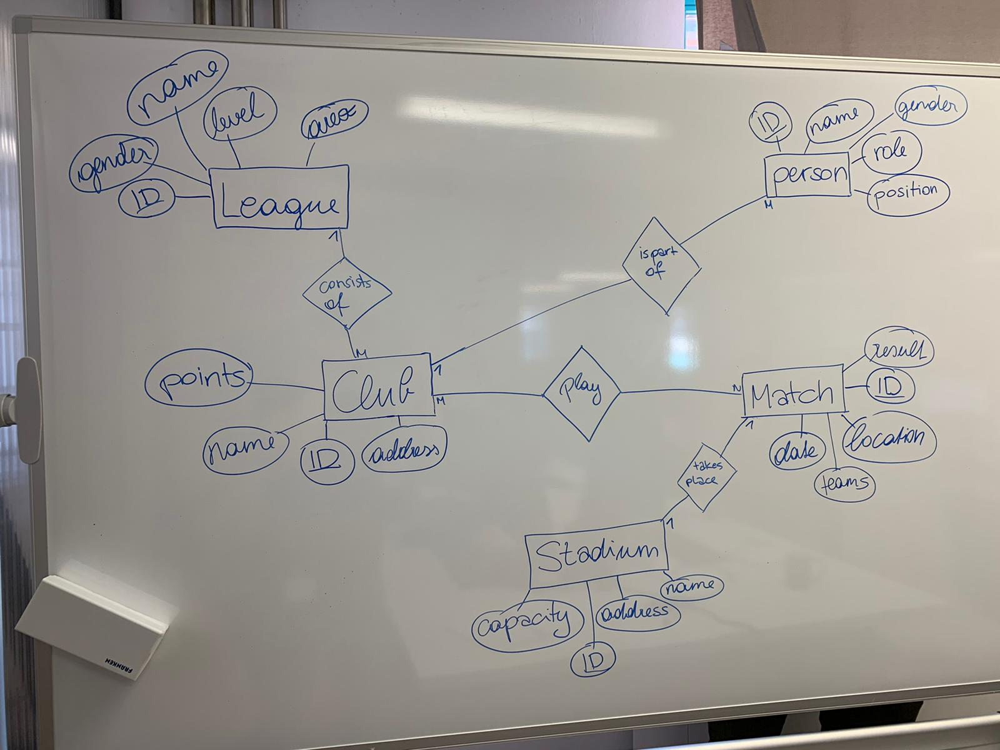
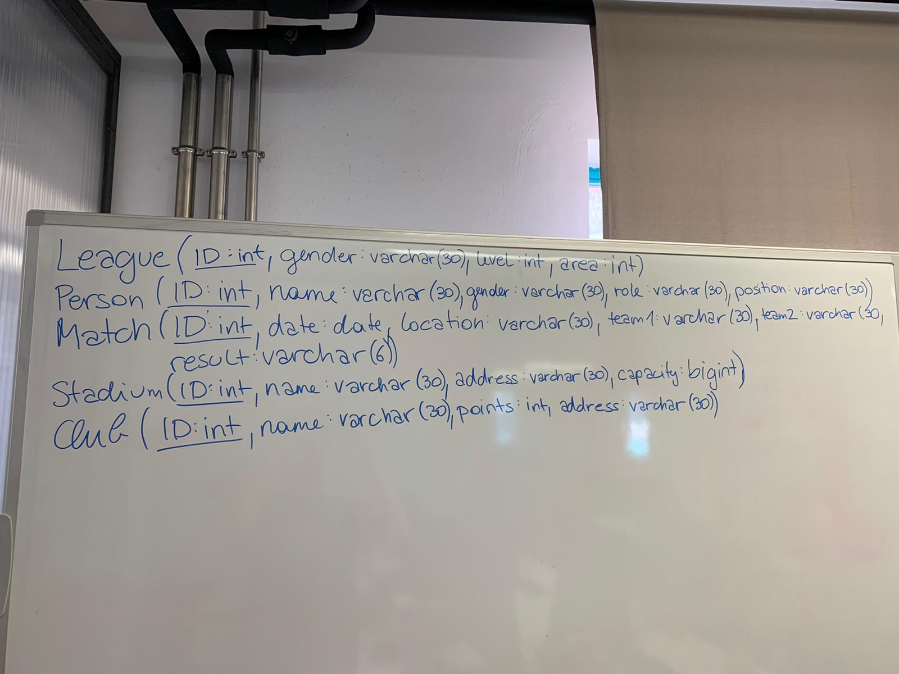
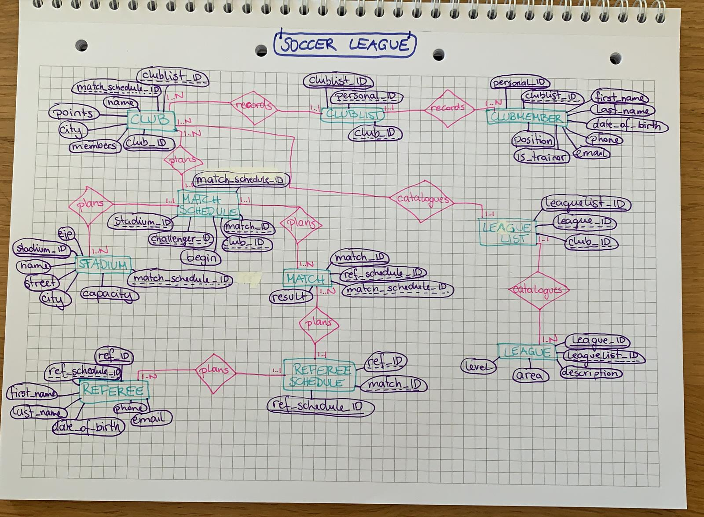

erm-league-captainlisa

## my individual work

## the groups work

## version 2

* Clubmember (**personal_ID:int**, *clublist_ID:int*, first_name:varchar(20), last_name:varchar(20), date_of_birth:date, phone:varchar(32), email:varchar(32), is_trainer:boolean, position:varchar(20))
* Referee (**ref_ID:int**, *ref_schedule_ID:int*, first_name:varchar(20), last_name:varchar(20), date_of_birth:date, phone:varchar(32), email:varchar(32))
* Referee Schedule (**ref_schedule_ID:int**, *ref_ID:int*, *match_ID:int*)
* Clublist (**clublist_ID:int**, *personal_ID:int*, *club_ID:int*)
* Club (**club_ID:int**, *clublist_ID:int*, *match_schedule_ID:int*, name:varchar(32), points:int, city:varchar(20), members:int)
* Match (**match_ID:int**, *ref_schedule_ID:int*, *match_schedule_ID:int*, result:varchar(5))
* Match Schedule (**match_schedule_ID:int**, *match_ID:int*, *club_ID:int*, *challenger_ID:int*, *stadium_ID:int*, begin:timestamp)
* Stadium (**stadium_ID:int**, *match_schedule_ID:int*, name:varchar(20), street:varchar(32), zip:int, city:varchar(20), capacity:int)
* League (**league_ID:int**, *leaguelist_ID:int*, description:varchar(32), area:varchar(20), level:int)
* Leaguelist (**leaguelist_ID:int**, *league_ID:int*, *club_ID:int*)